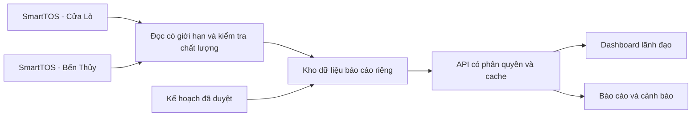

# Kế hoạch nâng cấp dashboard điều hành sản xuất

Ngày lập: 09/09/2026. Phạm vi: Cửa Lò và Bến Thủy. Đây là kế hoạch đề xuất; các chức năng ở giai đoạn tiếp theo chưa được triển khai.

**Cập nhật sau rà soát dữ liệu lần 2:** đã hoàn tất inventory hai DB, kiểm tra toàn lịch sử TallyShift, phân tích nghiệp vụ năm 2026 và đối chiếu API nguồn. Đã áp dụng nhóm `SANLUONG-QUACANG`, bỏ hệ số container ghi cứng, tách đơn vị khác khỏi tấn và công bố dữ liệu thiếu. P0 còn xử lý ngoại lệ theo chứng từ, phê duyệt KPI và điều kiện vận hành. Hồ sơ đối soát chi tiết được lưu nội bộ, không xuất bản trong repository.

**Cập nhật phần chuyến tàu:** đã thêm danh sách chuyến, tìm theo tên/mã, xem chi tiết hàng hóa, sản lượng theo ngày và phiếu tác nghiệp phân trang theo cùng kỳ/xí nghiệp. Các lưu ý rải dưới KPI đã được ẩn theo yêu cầu; metadata nằm trong phần nguồn dữ liệu thu gọn. Bằng chứng kiểm tra trực tiếp được lưu trong hồ sơ nội bộ; hướng dẫn API và kiểm thử fixture có trong README.

## 1. Kết quả cần đạt

Trong một phút, lãnh đạo trả lời được: sản lượng đến đâu, đơn vị nào tăng/giảm, có đạt kế hoạch không, vướng mắc nào cần xử lý, ai chịu trách nhiệm và số liệu được cập nhật đến khi nào.

Bản sửa hiện tại cung cấp nền tảng xem sản lượng theo kỳ và xí nghiệp, biểu đồ thống nhất cách tính, thông báo lỗi/thiếu dữ liệu và xuất CSV. Đã đọc database và kiểm tra các tổng API khớp nhau; trước khi dùng làm báo cáo chính thức, phải đối chiếu chứng từ và chốt quy tắc nghiệp vụ. Kết nối SQL Server có lúc timeout trong quá trình rà soát nên cần xác nhận độ ổn định đường mạng.

## 2. Lộ trình theo thứ tự ưu tiên

### Mức sẵn sàng sử dụng hiện tại

**Đủ dùng thử để theo dõi sản lượng đã ghi nhận; chưa đủ làm dashboard điều hành giao ban độc lập.** Đánh giá này căn cứ chức năng và hợp đồng API hiện có, không phải tỷ lệ phần trăm hoàn thành dự án.

| Câu hỏi của lãnh đạo | Hiện tại | Phần cần hoàn thiện |
|---|---|---|
| Đã sản xuất bao nhiêu, ở xí nghiệp nào? | Có tấn/TEU, xu hướng, cơ cấu, dữ liệu thiếu và tra chuyến đến phiếu | Chốt ngoại lệ, phạm vi và đơn vị; mở rộng tra phiếu từ mọi KPI/chiều phân tích |
| Có đạt kế hoạch và cần bù bao nhiêu? | Chưa có thực hiện/kế hoạch trong API hoặc giao diện | Kế hoạch sản lượng tháng/năm được duyệt, cùng đơn vị với thực hiện; không thay bằng kế hoạch ca/tài nguyên chỉ vì nguồn có bảng Plan |
| Hoạt động tàu và năng lực khai thác ra sao? | Chỉ đang đếm mã chuyến có tác nghiệp qua cảng; năng suất chưa khả dụng | Tách tàu đến, tàu rời, tàu làm hàng; kiểm chứng mốc thời gian, trạng thái, thời gian dừng và nguyên nhân |
| Kho bãi còn tiếp nhận được bao nhiêu? | Chưa có chỉ tiêu đã xác minh | Tồn tại thời điểm chốt và sức chứa hữu dụng cùng đơn vị, tuổi tồn, hàng dự kiến đến |
| Việc gì cần quyết định, ai xử lý, đến bao giờ? | Có lưu ý chất lượng dữ liệu; chưa có luồng xử lý công việc | Danh sách vấn đề có ảnh hưởng, mức ưu tiên, người phụ trách, hạn và trạng thái |

**Chuyến có tác nghiệp qua cảng khác lượt tàu đến theo ATA và lượt rời theo ATD.** Hai cách đếm có thể cho cùng tổng nhưng khác danh sách chuyến. Danh sách hiện tại minh bạch đúng tập chuyến của KPI; chưa thay định nghĩa thành lượt đến/rời. Số liệu và định danh chuyến dùng đối soát được giữ trong hồ sơ nội bộ.

Màn hình giao ban đề xuất: đầu trang là kỳ, độ mới và độ đầy đủ dữ liệu; hàng KPI là thực hiện ngày/lũy kế tháng so với kế hoạch; phần giữa là tiến độ, đóng góp xí nghiệp và việc cần quyết định; phần dưới là tàu, nguồn lực, kho bãi và đường dẫn tra cứu chứng từ. Đây là đề xuất, chưa triển khai các nhóm tính năng còn thiếu.

Thời lượng là ước lượng cho một lập trình viên phối hợp với CNTT/DBA và Phòng Khai thác; tính từ lúc được truy cập nguồn dữ liệu và có người xác nhận nghiệp vụ.

| Giai đoạn | Công việc | Chủ trì/phối hợp | Thời lượng | Điều kiện nghiệm thu |
|---|---|---|---|---|
| P0 — Chốt số liệu | Ổn định truy cập SQL; đối chiếu phiếu ca, chuyến tàu và báo cáo tháng; xác nhận bản ghi xóa, bản nháp, tổng hợp cuối, điều chỉnh; ký bộ định nghĩa KPI | Khai thác + DBA + người làm báo cáo | 2–4 ngày | Đối chiếu ít nhất 3 kỳ gồm ngày thường, cuối tháng, ca qua đêm; tổng theo chiều bằng tổng chung trước làm tròn; mọi chênh lệch có lý do |
| P0 — Truy cập nội bộ | Thay thông tin đăng nhập từng được ghi cứng; cấp tài khoản chỉ đọc đúng bảng/view; xác thực người dùng qua cơ chế công ty; HTTPS, mạng nội bộ/VPN, quản lý bí mật; kiểm tra quyền xem toàn công ty/xí nghiệp | CNTT + DBA | 2–3 ngày, có thể song song | Người chưa đăng nhập không đọc API; người dùng chỉ xem phạm vi được cấp; tài khoản dashboard không ghi dữ liệu TOS |
| P1 — Kế hoạch và tiến độ | Nhập kế hoạch năm/tháng theo đơn vị và đơn vị tính; có phiên bản và người duyệt; thực hiện/kế hoạch, chênh lệch, mức cần đạt mỗi ngày còn lại; cùng kỳ năm trước | Kế hoạch + Khai thác + phát triển | 4–6 ngày | Số kế hoạch khớp văn bản đã duyệt; tháng chưa có kế hoạch hiển thị thiếu dữ liệu; công thức và lịch làm việc được ký xác nhận |
| P1 — Tra cứu nguyên nhân | Mở rộng luồng chuyến → phiếu đã có sang mọi KPI, ngày, xí nghiệp và mặt hàng; tối ưu phân trang tại server; xuất dữ liệu có bộ lọc và thời điểm tổng hợp | Phát triển + Khai thác | 3–5 ngày | Từ mọi tổng số truy được danh sách chứng từ; tổng chi tiết khớp KPI trong cùng phiên dữ liệu |
| P2 — Điều hành khai thác | Tàu đang/chờ/làm hàng theo mốc thời gian được duyệt; năng suất thực tế; chờ cầu bến, dừng thiết bị, nguyên nhân chậm; tồn kho và sức chứa đúng đơn vị | Khai thác + điều độ + kho bãi | 1–2 tuần | Ca qua đêm, thời gian thiếu/âm/trùng máng, chuyến chưa rời đều được xử lý; tồn cuối = tồn đầu + nhập − xuất + điều chỉnh |
| P2 — Cảnh báo và vận hành | Ngưỡng theo đơn vị/mặt hàng; cảnh báo tụt tiến độ, dữ liệu chậm, kho vượt tải; người phụ trách và trạng thái xử lý; cache, giám sát, sao lưu cấu hình và hướng dẫn sử dụng | Khai thác + CNTT | 3–5 ngày | Ngưỡng được lãnh đạo duyệt; cảnh báo có nguồn và thời điểm; kiểm thử tải theo lượng người thật; có quy trình xử lý sự cố |

Mục tiêu khả thi: bản dùng thử nội bộ sau P0, bản phục vụ họp giao ban sau P1; không chờ đủ tính năng P2 để lấy phản hồi người dùng.

## 3. Bộ chỉ tiêu cần thống nhất

| Chỉ tiêu | Định nghĩa dự kiến | Nguồn/điều kiện cần chốt |
|---|---|---|
| Khối lượng ghi nhận qua cảng | Tổng `weightNetSum` của nhóm SANLUONG-QUACANG với đơn vị TAN; KG theo quan hệ nguồn xác thực | Đã áp dụng. NULL báo thiếu; giữ riêng đơn vị khác. Nguồn có thể ghi trọng lượng quy đổi container, không mặc định là cân thực tế |
| Các đơn vị nguồn khác | Tổng riêng từng đơn vị và xí nghiệp, không cộng vào KPI tấn | Đã có bảng và CSV. Phần cần bổ sung là luồng xử lý phiếu ngoại lệ và quy tắc chuyển đổi có chứng từ/ngày hiệu lực nếu được duyệt |
| Container TEU | Số container theo kích thước × hệ số TEU đã duyệt | Đối chiếu `quantityTotalSum`, `containerBoxSum`, `containerTeuSum`; quy tắc 45 feet, rỗng/đầy/lạnh và mã hàng mới |
| Chuyến tàu có phát sinh | Đếm riêng cặp xí nghiệp + `vesselVoyageId` có sản lượng trong kỳ | Khác số tàu cập/rời; muốn số cập/rời phải dùng ATA/ATD của bảng chuyến |
| Hoàn thành kế hoạch | Thực hiện / kế hoạch đã duyệt × 100% | Tách tấn và TEU; thiếu kế hoạch hoặc kế hoạch 0 trả về chưa xác định |
| Tiến độ theo ngày | Thực hiện lũy kế so với kế hoạch phân bổ theo lịch sản xuất | Không lấy tuyến tính theo ngày lịch nếu công ty có mùa vụ/ngày nghỉ khác nhau |
| Năng suất máng | Khối lượng cùng phạm vi / tổng giờ máng hợp lệ | Một khoảng giờ chỉ tính một lần cho cùng máng; xác định trừ thời gian dừng, đổi ca và ca qua đêm |
| Thời gian tàu tại cảng | ATD − ATA trên chuyến đã rời | Nếu muốn thời gian chiếm cầu dùng mốc vào/rời cầu; không đánh đồng cả hai |
| Lấp đầy kho/bãi | Tồn tại thời điểm báo cáo / sức chứa hữu dụng cùng đơn vị | Cộng đúng theo kho + hàng/chủ hàng; sức chứa tấn/m³/TEU/m² phải phân biệt; tồn đầu và điều chỉnh phải đầy đủ |
| Doanh thu | Doanh thu được ghi nhận theo kỳ kế toán | Tích hợp nguồn tài chính và phân quyền sau; không suy ra từ sản lượng × giá bình quân rồi gọi là doanh thu thực |

Quy tắc so sánh hiện tại là **kỳ liền trước có cùng số ngày**, hiển thị chính xác hai khoảng ngày. P1 bổ sung lựa chọn tháng trước/cùng kỳ năm trước, xử lý ngày 29/2 và tháng thiếu ngày theo quy ước được duyệt.

## 4. Dữ liệu và kiến trúc đề xuất

Đây là kiến trúc đích, chưa tạo thêm bảng/view hay pipeline trên database nguồn.

- **Khóa nguồn:** mọi khóa nghiệp vụ đi kèm `source_system`/xí nghiệp, tránh trùng ID giữa hai DB.
- **Dữ liệu sản lượng:** lưu mức phiếu ca hoặc mức nguyên tử được xác nhận; giữ ID nguồn, thời điểm sửa, trạng thái duyệt/xóa, liên kết điều chỉnh; không cộng đồng thời dòng chi tiết và dòng tổng hợp cuối.
- **Danh mục:** xí nghiệp, ngày/ca, loại hàng, hướng hàng, phương án xếp dỡ, chủ hàng, tàu/chuyến; mã nghiệp vụ ổn định thay cho tìm chữ trong tên. Ánh xạ chủ hàng liên xí nghiệp phải được duyệt, không tự gộp theo tên viết tắt.
- **Hệ số và kế hoạch:** bảng quy tắc quy đổi có ngày hiệu lực, phiên bản và người duyệt; kế hoạch theo kỳ/xí nghiệp/chỉ tiêu/đơn vị, giữ lịch sử thay đổi.
- **Tải tăng dần:** đọc theo `updateTime` kèm khoảng đọc bù và đối chiếu định kỳ; xử lý xóa mềm/sửa hồi tố. `shiftDate` chỉ là ngày nghiệp vụ, không thay cho mốc đồng bộ.
- **Độ mới:** công bố riêng lần tải thành công, ngày nghiệp vụ mới nhất và độ trễ từng nguồn. Một nguồn mất kết nối không được hiển thị tổng toàn công ty như đã đủ hai nguồn.
- **Hiệu năng:** đo kế hoạch thực thi trước khi đề xuất index trên `shiftDate` và điều kiện lọc; thử trên bản sao/staging. Chốt SLA dự kiến API p95 dưới 3 giây khi cache và dưới 10 giây khi đọc mới, sau khi đo tải thật.
- **Nhất quán:** ưu tiên tập dữ liệu báo cáo có phiên bản. Một truy vấn dùng chung giúp các panel khớp nhau nhưng không tự bảo đảm snapshot giao dịch giữa hai DB. Cần DBA đánh giá isolation/replica; Microsoft mô tả snapshot/RCSI trong [hướng dẫn khóa và row versioning](https://learn.microsoft.com/en-us/sql/relational-databases/sql-server-transaction-locking-and-row-versioning-guide?view=sql-server-ver17).

## 5. Thiết kế màn hình tiếp theo

1. **Giao ban:** kỳ báo cáo, xí nghiệp, độ mới; sản lượng lũy kế, kế hoạch, chênh lệch; ba việc cần xử lý ưu tiên với người phụ trách.
2. **Sản lượng:** xu hướng ngày/tháng, tấn/TEU riêng, phân rã biến động theo xí nghiệp và hàng, bấm xuống chứng từ.
3. **Tàu và năng suất:** danh sách tàu có trạng thái theo nguồn, thời gian chờ/làm hàng, mục tiêu và nguyên nhân chậm.
4. **Kho bãi:** tồn và sức chứa cùng đơn vị, tuổi tồn, cảnh báo vượt tải; xem đúng thời điểm báo cáo.

Tất cả màn hình giữ cùng bộ lọc và có trạng thái đang tải, dữ liệu trống, nguồn lỗi, dữ liệu cũ. Màu đỏ chỉ dùng khi vượt một ngưỡng đã duyệt, không mặc định mọi giảm sản lượng đều là sự cố.

## 6. Nghiệm thu trước khi bàn giao chính thức

- Khai thác xác nhận công thức, ca, hệ số và 3 kỳ đối chiếu; DBA xác nhận schema/quyền đọc và hiệu năng.
- Kiểm tra hai DB có ID chuyến/chủ hàng trùng nhau, phiếu xóa/điều chỉnh, NULL, trọng lượng âm, nhóm hàng mới, ngày cuối tháng và ca qua đêm.
- Mất một nguồn, SQL timeout, lỗi schema: báo lỗi rõ, không xuất số mẫu; tổng chi tiết khớp ô KPI trong cùng báo cáo.
- Kế hoạch có phê duyệt; thiếu mẫu số hiển thị chưa xác định; CSV giữ đơn vị, bộ lọc, định nghĩa và hạn chế dữ liệu.
- Kiểm tra trình duyệt desktop/mobile, bàn phím, tài khoản thật, phân quyền API, HTTPS và hoàn nguyên bản phát hành.
- Hướng dẫn giao ban 1 trang và người phụ trách dữ liệu từng xí nghiệp; vận hành thử ít nhất 1 tuần trước khi thay báo cáo hiện hành.
