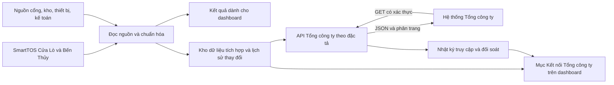

# Phân loại và kế hoạch API Tổng công ty

Ngày rà soát: 21/09/2026. Mã nguồn đối chiếu: `b56c744`.

**Cập nhật phạm vi ngày 25/09/2026:** giữ bộ sản lượng S (13 API chính, không RORO)
và bổ sung 20 đường dẫn danh mục của hai bộ vận hành Bulk/Container. Mười danh mục
dùng chung B/C chỉ có một đường dẫn. Các API tác nghiệp, tồn, thiết bị vận hành và
doanh thu vẫn thuộc kế hoạch mở rộng. Xem [API_SAN_LUONG_S.vi.md](API_SAN_LUONG_S.vi.md)
và [API_DANH_MUC_VAN_HANH.vi.md](API_DANH_MUC_VAN_HANH.vi.md) để phân biệt mã nguồn
đã triển khai, dữ liệu đã xác minh và điều kiện công bố.

## 1. Kết luận và phạm vi

Nên dùng chung repository và phần xử lý dữ liệu có cùng định nghĩa nghiệp vụ, đồng thời xây module cung cấp API Tổng công ty riêng với API dashboard. Ba tài liệu mô tả chủ yếu mô hình **Tổng công ty gọi GET để lấy dữ liệu tại đơn vị cảng**. Vì vậy, kế hoạch ưu tiên xây API cung cấp dữ liệu và theo dõi lượt lấy; chưa có căn cứ xây tác vụ POST đẩy dữ liệu sang Tổng công ty.

Đã đọc nội dung, ghi chú, dấu gạch bỏ và kiểm kê trạng thái của toàn bộ **71 sheet**, đều hiển thị, không có ảnh nhúng. Có **65 mục đặc tả API**, bao gồm ba bản mô tả login. Sau đối chiếu ô `API` và bỏ khoảng trắng đầu/cuối, có **52 đường dẫn gốc khác nhau**: 51 đường dẫn dữ liệu và 1 login. Đây là thống kê bản đặc tả, chưa phải 52 endpoint đã được chốt hợp đồng: chưa tính riêng các đường dẫn lấy chi tiết theo ID; một số ô `API`, `Endpoint` và mẫu request còn khác nhau.

| Bộ tài liệu | Sheet | Mục API | Phân loại |
|---|---:|---:|---|
| Sản lượng v3 (S) | 17 | 15 | 6 sản lượng tổng hợp + 8 danh mục + 1 login |
| Vận hành Bulk v1.5 (B) | 28 | 26 | 8 nghiệp vụ + 17 danh mục + 1 login |
| Vận hành Container v1.5 (C) | 26 | 24 | 10 nghiệp vụ + 13 danh mục + 1 login |

**Bulk trong bộ vận hành là hàng ngoài container**, bao gồm hàng rời, hàng bao và các nhóm hàng khác theo danh mục; không giới hạn ở hàng xá. Hai mặt cắt cầu tàu/cổng trong bộ sản lượng là hai chỉ tiêu riêng, không cộng thành một tổng thông qua. Các tác nghiệp cầu, bãi, cổng và thiết bị cũng không được cộng chồng khối lượng của cùng một lô/container.

Lượt này chỉ phân loại và lập kế hoạch từ tài liệu cùng mã nguồn. Chưa truy vấn live SQL cho các trường mới, chưa gọi hệ thống Tổng công ty, chưa triển khai API và chưa sửa file Excel nguồn. Không dùng dữ liệu mẫu trong tài liệu làm số liệu thật.

## 2. Nguồn tham chiếu

- **S**: [API Domain SLG_CB (Spec)_v3.xlsx](<../API Vận Hành/API Domain SLG_CB (Spec)_v3.xlsx>).
- **B**: [API_Domain_VanHanh_CB_Bulk (Spec)_v1.5.xlsx](<../API Vận Hành/API_Domain_VanHanh_CB_Bulk (Spec)_v1.5.xlsx>).
- **C**: [API_Domain_VanHanh_CB_Cont (Spec)_v1.5.xlsx](<../API Vận Hành/API_Domain_VanHanh_CB_Cont (Spec)_v1.5.xlsx>).

Vị trí nguồn trong các bảng dưới dùng ký hiệu `S/B/C`, tên sheet và tọa độ Excel. Danh sách tổng thể: `S!Danh mục tổng thể API!E9:W23`, `B!APIs`, `C!APIs`. Mã nguồn đối chiếu chính: `backend/repository.py`, `backend/berth_scope.py`, `backend/reporting.py`, `backend/control_api.py`, `backend/control_store.py`, `backend/inspect_database.py`.

File S đã có **companyId = CNT** cho Công ty CP Cảng Nghệ Tĩnh tại `CompanyID!B49:F49`. Hai file B/C chỉ có danh mục mẫu Hải Phòng và đơn vị liên quan. Cần xác nhận mã CNT dùng chung cho cả ba domain và cách biểu diễn Cửa Lò/Bến Thủy; chưa tự tạo mã công ty con hoặc dùng mã ví dụ của Hải Phòng.

## 3. Danh mục thực hiện

Mức ưu tiên dưới đây là đề xuất triển khai, không phải xác nhận đã có đủ dữ liệu:

- **P0**: hợp đồng, định danh, xác thực và nền tảng giao tiếp.
- **P1**: danh mục nền, tàu/chuyến và sản lượng qua cầu tàu; có phần nguồn đã được truy vấn trong dashboard.
- **P2**: tác nghiệp chi tiết, cổng, bãi, tồn và các danh mục phụ thuộc; cần khảo sát nguồn bổ sung.
- **P3**: thiết bị, thời gian vận hành, kế hoạch tác nghiệp và doanh thu; cần chủ dữ liệu chuyên trách.
- **P2 có điều kiện**: RORO; phải xác nhận có nghiệp vụ và có yêu cầu áp dụng tại Nghệ Tĩnh.

### 3.1. Bộ sản lượng S

Các path dưới lấy ở ô `L4` của sheet tương ứng. GET là chức năng lấy dữ liệu; ba danh mục ghi `GET /POST` trong Method nhưng Endpoint chỉ mô tả GET, nên POST chưa đủ đặc tả để thực hiện.

| API / sheet S | Path gốc | Nghiệp vụ | Ưu tiên |
|---|---|---|---|
| `1.login` | `/api/login` | POST lấy token, tùy cơ chế xác thực đã thống nhất | P0 |
| `2.1 contQuayVolumesCB` | `/api/contQuayVolumesCB` | Tấn và TEU container qua cầu tàu | P1 |
| `2.2 contGateVolumesCB` | `/api/contGateVolumesCB` | Tấn và TEU container qua cổng/kho bãi | P2 |
| `3.1 bulkQuayVolumesCB` | `/api/bulkQuayVolumesCB` | Tấn nhóm Bulk của bộ sản lượng qua cầu tàu | P1 |
| `3.2 bulkGateVolumesCB` | `/api/bulkGateVolumesCB` | Tấn nhóm Bulk của bộ sản lượng qua cổng/kho bãi | P2 |
| `4.1 ROROQuayVolumesCB` | `/api/ROROQuayVolumesCB` | Số xe và tấn RORO qua cầu tàu | P2 có điều kiện |
| `4.2 ROROGateVolumesCB` | `/api/ROROGateVolumesCB` | Số xe và tấn RORO qua cổng/kho bãi | P2 có điều kiện |
| `9. shipDetails` | `/api/shipDetails` | Tàu vật lý, IMO, thông số và chủ tàu | P1 |
| `10. customer` | `/api/customers` | Khách hàng, hãng tàu, đại lý | P1 |
| `11. cargoType` | `/api/cargoType` | Loại hàng | P1 |
| `12. cargoCategory` | `/api/cargoCategory` | Cây nhóm hàng | P1 |
| `13. handlingMethodList` | `/api/handlingMethodList` | Phương án tác nghiệp theo domain sản lượng | P1 |
| `14. class` | `/api/class` | Hướng tàu/hàng theo định nghĩa Tổng công ty | P1 |
| `15. origins` | `/api/origins` | Nguồn gốc hàng | P1 |
| `16. containerSize` | `/api/containerSize` | Kích thước và mã loại container | P1 |

Sản lượng container qua cầu cần các chiều `finishDate`, `companyId`, `shipId`, `classId`, `originId`, `handlingMethodId`, `shipOperatorId`, `containerOperatorId`, `containerSizeId` cùng `containerWeight/containerTEU` (`S!2.1 contQuayVolumesCB!C56:L67`). Dashboard có tổng theo chuyến và mã hàng, nhưng chưa chứng minh có đủ các chiều hãng khai thác, chủ vỏ, nguồn gốc và kích thước ISO. Không lấy nguyên tổng KPI rồi coi là đủ payload này.

Trong S, mô tả Bulk gọi là hàng rời nhưng trường cargoTypeId lại liệt kê cả container và RORO (`3.1 bulkQuayVolumesCB!L5,L59`). Cần chốt bảng phân loại S để các nhóm Cont/Bulk/RORO không chồng nhau; không tự mang phạm vi “mọi hàng ngoài container” của bộ vận hành B sang các chỉ tiêu tổng hợp S.

### 3.2. Bộ vận hành Bulk B

Các sheet từ `2. vesselBerthSchedules` đến `9. bulkRevenue` là 8 API nghiệp vụ. Đường dẫn ở bảng này lấy theo dòng `Endpoint`, thường `L8` hoặc `M8`; các lệch với dòng API được giữ thành vấn đề cần chốt.

| API / sheet B | Path GET | Nghiệp vụ | Ưu tiên |
|---|---|---|---|
| `2. vesselBerthSchedules` | `/api/oprt/vesselBerthSchedules` | Chuyến tàu, cập/rời cầu; dùng chung C | P1 |
| `3. bulkQuayJob` | `/api/oprt/quay/bulk` | Tác nghiệp hàng qua cầu | P2 |
| `4. bulkYardJob` | `/api/oprt/yard/bulk` | Tác nghiệp kho bãi | P2 |
| `5. bulkYardInv` | `/api/oprt/yard/bulkInv` | Nhập, xuất, tồn hàng | P2 |
| `6. bulkGateJob` | `/api/oprt/gate/bulk` | Tác nghiệp xe/cổng | P2 |
| `7. bulkEquipJob` | `/api/oprt/bulkEquipments` | Công việc thiết bị | P3 |
| `8. bulkEquipRuntime` | `/api/oprt/bulkEquipRuntime` | Giờ hoạt động, nhàn rỗi, sự cố, bảo trì | P3 |
| `9. bulkRevenue` | `/api/oprt/bulkRevenue` | Doanh thu nghiệp vụ | P3 |

17 danh mục của B:

| Sheet B | Path GET | Thứ tự phụ thuộc |
|---|---|---|
| `9. portEquipment` | `/api/oprt/catalog/portEquipment` | Danh mục tối thiểu trước job có tham chiếu; mở rộng cùng nhóm P3 |
| `10. portEquipType` | `/api/oprt/catalog/portEquipType` | Trước thiết bị |
| `11. portWHYard` | `/api/oprt/catalog/portWHYard` | Trước tác nghiệp bãi/tồn P2 |
| `12. portWHYardType` | `/api/oprt/catalog/portWHYardType` | Trước kho bãi |
| `13. portBerth` | `/api/oprt/catalog/berths` | Trước chuyến/cầu P1 |
| `14. jobType` | `/api/oprt/catalog/jobType` | Trước tác nghiệp P2 |
| `15. jobMethod` | `/api/oprt/catalog/jobMethod` | Trước tác nghiệp P2 |
| `16. deliveryMethod` | `/api/oprt/catalog/deliveryMethod` | Trước tác nghiệp P2 |
| `17. serviceType` | `/api/oprt/catalog/serviceType` | Trước tác nghiệp/doanh thu |
| `18. cargoItems` | `/api/oprt/catalog/cargoItems` | Trước bulk jobs P2 |
| `19. cargoGroups` | `/api/oprt/catalog/cargoGroups` | Trước mặt hàng |
| `20. unitMeasurement` | `/api/oprt/catalog/unitMeasurement` | Trước khối lượng/số lượng |
| `21. cargoDirect` | `/api/oprt/catalog/cargoDirect` | Trước tác nghiệp |
| `22. operationLocationType` | `/api/oprt/catalog/operationLocationType` | Trước vị trí/thiết bị |
| `23. portOpTeam` | `/api/oprt/portOpTeam` | Trước job yêu cầu đội, nhân sự |
| `24. portOpStaff` | `/api/oprt/portOpStaff` | Trước job yêu cầu nhân sự |
| `25. vesselType` | `/api/oprt/catalog/vesselType` | Trước chuyến P1 |

`1.login` của B lặp `/api/login` thuộc nhóm P0, không xây một cơ chế đăng nhập người dùng mới cho từng bộ. Riêng `bulkGateJob!L9` ghi **hàng tháng**; các GET khác trong B ghi hàng ngày hoặc theo yêu cầu. Cần xác nhận đây là chủ ý hay lỗi mẫu.

### 3.3. Bộ vận hành Container C

| API / sheet C | Path GET | Nghiệp vụ | Ưu tiên |
|---|---|---|---|
| `2. vesselBerthSchedules` | `/api/oprt/vesselBerthSchedules` | Dùng chung chuyến tàu với B | P1 |
| `3. contQuayJob` | `/api/oprt/quay/containers` | Từng tác nghiệp container qua cầu | P2 |
| `4. contYardJob` | `/api/oprt/whYard/containers` | Tác nghiệp container trong kho/bãi | P2 |
| `5. contYardInv` | `/api/oprt/yard/contInv` | Nhập/xuất và lưu bãi từng container; thời điểm tồn cần chốt | P2 |
| `6. contGateJob` | `/api/oprt/gate/containers` | Container qua cổng | P2 |
| `7. contEquipJob` | `/api/oprt/contEquipments` | Công việc thiết bị trên container | P3 |
| `8. contOps` | `/api/oprt/contOps` | Hồ sơ vận hành/vòng đời container | P2 |
| `9. contEquipRuntime` | `/api/oprt/contEquipRuntime` | Giờ hoạt động thiết bị | P3 |
| `10. contOperationalPlan` | `/api/oprt/contOperationalPlan` | Kế hoạch tác nghiệp container | P3 |
| `11. contRevenue` | `/api/oprt/contRevenue` | Doanh thu container | P3 |

13 danh mục của C: `12. portEquipment`, `13. portWHYard`, `14. portWHYardType`, `15. portBerth`, `16. jobType`, `17. jobMethod`, `18. deliveryMethod`, `19. serviceType`, `20. cargoDirect`, `21. portOpTeam`, `22. portOpStaff`, `23. vesselType`, `24. contSizeType`.

- 10 danh mục trùng path với B: `/api/oprt/catalog/portWHYardType`, `/berths`, `/jobType`, `/jobMethod`, `/deliveryMethod`, `/serviceType`, `/cargoDirect`, `/vesselType` dưới cùng prefix `/api/oprt/catalog`; cùng `/api/oprt/portOpTeam` và `/api/oprt/portOpStaff`. Danh sách field và dấu bắt buộc đã được đối chiếu; vẫn phải chốt kiểu, enum, ghi chú và dấu loại bỏ trước khi dùng một schema chung.
- Thiết bị C dùng `/api/oprt/catalog/equipments`, kho bãi C dùng `/api/oprt/catalog/contwhYards`; khác path B dù cùng tên nghiệp vụ. Có thể dùng nguồn/mapping chung nhưng giữ adapter theo từng hợp đồng, không tự gộp payload.
- Kích thước loại container C dùng `/api/oprt/catalog/contSizeType`; khác `/api/containerSize` của S. Cần bảng ánh xạ, không đồng nhất tên trường theo suy đoán.
- Login C lặp `/api/login`. Các GET của C ghi hàng ngày hoặc theo yêu cầu. Không có yêu cầu realtime được xác nhận.

Các danh mục tối thiểu `portOpTeam → portOpStaff`, `contSizeType`, thiết bị và vị trí phải sẵn trước job có khóa tham chiếu tương ứng. `contOps` và các job cầu/bãi/cổng có staffId bắt buộc; không đợi giai đoạn mở rộng nhân sự/thiết bị mới cung cấp danh mục nền. `contYardInv` hiện lọc theo ngày tạo/sửa và có inbound/outbound/dwellTime, chưa có tham số as-of: cần thống nhất cách tạo số tồn tại một thời điểm trước khi coi đây là API snapshot tồn.

## 4. Phần dùng chung và mức sẵn sàng của nguồn

| Nhóm dữ liệu | Bằng chứng hiện có trong mã | Phần cần khảo sát trước khi triển khai |
|---|---|---|
| Khối lượng và TEU theo ca/chuyến | `TallyShift`, `Cargo`, `BaseUnit`, `ConversionUnit`, `JobMethod`, `StatisticsGroupType`; `repository.py:205–235,297–319,470–563` | Ngày hoàn tất so với `shiftDate`; phạm vi hai mặt cắt; hãng khai thác/chủ vỏ/nguồn gốc; đúng mức tổng hợp của S |
| Tàu và chuyến | `Vessel`, `VesselVoyage`, ATA/ATD và mã chuyến đang dùng | IMO, loại tàu, kích thước, chủ tàu, inVoyage/outVoyage, mã GUID, đủ bản ghi không phát sinh sản lượng |
| Cầu/bến | `DoBerth`, `Berth`; `berth_scope.py:24–78` dùng lịch sử cầu đầu | Lịch sử từng lần cập/chuyển/rời cầu, lịch dự kiến, thời gian bắt đầu/kết thúc; dữ liệu thực tế từng job |
| Khách hàng | `Partner` qua `TallyShift.consigneeId`; `repository.py:299` | Vai trò shipper/consignee/đại lý/chủ tàu/chủ vỏ; mã số thuế và các trường danh bạ; mapping hai database |
| Danh mục hàng, hướng, phương án | Có `Cargo`, `CargoDirect`, `JobMethod`; CLI có mục khảo sát `CargoGroup`, `JobMethodType` | Mã chuẩn Tổng công ty, danh mục nguồn gốc, quan hệ cha/con; CLI có tên bảng không chứng minh nguồn đang đủ và đúng nghĩa |
| Kho bãi, cổng và tồn | CLI liệt kê `Warehouse`, `vwStatisticsWarehouseInventoryByDay` để khảo sát | Chưa có endpoint khai thác nguồn này; cần sổ kho/xe/cổng, thời điểm tồn, đơn vị, điều chỉnh và lịch sử |
| Từng container | Dashboard gộp `20F/20E/40F/40E/...` và đếm TEU theo số lượng | Chưa có dữ liệu được truy vấn về số container, `contRowGuid`, vòng đời, seal/ISO/chủ vỏ, vị trí từng container |
| Thiết bị, đội và nhân viên | Chưa có luồng truy vấn nghiệp vụ tương ứng trong dashboard | Xác định TOS/hệ quản lý thiết bị/nhân sự là nguồn nào; quan hệ nhiều người hoặc thiết bị trên một tác nghiệp |
| Kế hoạch tác nghiệp | Dashboard có chỉ tiêu sản lượng tháng/quý/năm/tuần | `contOperationalPlan` là kế hoạch làm hàng theo cấu trúc vận hành; không ánh xạ từ chỉ tiêu kế hoạch sản lượng |
| Doanh thu | Chưa có truy vấn hóa đơn/doanh thu | Nguồn kế toán/thu cước, ngày ghi nhận, trước/sau chiết khấu/thuế, điều chỉnh; xác định nguồn có thẩm quyền |

Những khác biệt bắt buộc giữ rõ:

1. Dashboard lọc `SANLUONG-QUACANG`, hướng 1/2 và bản ghi chưa xóa. API vận hành cần phạm vi rộng hơn cùng thông tin sửa/xóa. Không tái dùng nguyên câu truy vấn dashboard cho toàn bộ API mới.
2. Một số biến `vessel_id` trong dữ liệu giao diện thực chất đang giữ **vesselVoyageId**. API mới cần tách `shipId/vesselCode` của tàu và `vesselScheduleRowGuid` của chuyến; không lấy alias giao diện làm ID tàu.
3. Tấn hiện tại lấy `weightNetSum` với chuyển đổi đơn vị đã có bằng chứng. Không suy `cargoWeight`, `netWeight`, `invoicedWeight` đều bằng cùng giá trị. Giữ nguyên công thức dashboard, không đưa tấn bốc xếp hoặc nắp hầm vào chỉ tiêu đang sử dụng.
4. Quy tắc dashboard tách Cầu 5 theo cầu cập đầu tiên của cả chuyến tiếp tục giữ nguyên. Phạm vi API Tổng công ty phải được xác nhận riêng; cầu thực tế của từng tác nghiệp không bị thay bằng cầu đầu chuyến.
5. `consigneeId` không tự đồng nghĩa với hãng khai thác tàu, chủ vỏ container hoặc đại lý. Mã trùng giữa Cửa Lò và Bến Thủy phải được phân biệt bằng nguồn + ID; hợp nhất chỉ khi có căn cứ.
6. Một `contRowGuid` liên kết vòng đời/container không tự định danh duy nhất mọi job. Từng lần tác nghiệp cần khóa ổn định riêng để cập nhật hoặc xóa đúng bản ghi.

## 5. Các điểm cần chốt với Tổng công ty

| Mã | Vấn đề có bằng chứng trong tài liệu | Quyết định cần có |
|---|---|---|
| Q01 | S có CNT tại `CompanyID!B49:F49`; B/C chỉ có ví dụ Hải Phòng | CNT dùng cho domain nào; hai xí nghiệp biểu diễn bằng mã nào; phạm vi dữ liệu được cấp |
| Q02 | B/C `2. vesselBerthSchedules!L4` ghi `/api/vesselBerthSchedules`, `L8` ghi `/api/oprt/vesselBerthSchedules`; ghi chú còn đề nghị tên VesselVoyage | Base URL, path chuẩn, version và list/detail; không tự đổi theo comment chưa duyệt |
| Q03 | S `12. cargoCategory`, `13. handlingMethodList`, `16. containerSize` ghi GET/POST ở L7 nhưng chỉ mô tả GET ở L8 | Có thực sự cần POST hay chỉ là lỗi mẫu; nếu có cần body và quyền ghi riêng |
| Q04 | S `2.1 contQuayVolumesCB!X27:X28` lọc finishDate nhưng `C34` nói update_time; S `3.1 bulkQuayVolumesCB!X27:X28` nói transactionDate, `V41:V42` nói finishDate | Ngày nghiệp vụ và ngày thay đổi; cách lấy điều chỉnh quá khứ, biên ngày và múi giờ |
| Q05 | B/C mô tả startDate/endDate theo createdDate/modifiedDate, bao gồm thêm/sửa/xóa; B `2. vesselBerthSchedules` comment V39 yêu cầu dữ liệu chốt | Chỉ bản đã chốt hay toàn bộ trạng thái; cách phát hiện sửa/xóa sau chốt và backfill |
| Q06 | Nhiều job không có ID record ổn định; B cargoRowGuid bị bỏ ở các sheet quay/bãi/cổng; comment Bulk yard còn tranh luận mức chi tiết | Chốt một dòng là phiếu/job/xe/loại hàng/tổng chuyến; khóa bất biến, cách phân bổ lượng khi nhiều staff/thiết bị, cập nhật/xóa và phân trang |
| Q07 | B/C bảng `totalPages` nhưng sample `totalPage`; code khi có/rỗng khác kiểu; login `accessToken`/`AccessToken`, sample `expiresIn: 8h` | Chốt envelope, casing, HTTP status, kiểu số/chuỗi, null, enum, precision, token expiry và response rỗng |
| Q08 | Có trường gạch bỏ vẫn đánh dấu bắt buộc hoặc còn trong sample; B `bulkEquipJob!D69,D83` trùng cargoDirectId; `cargoGroups!D58:D59` trùng cargoGroupName | Một bản OpenAPI/JSON Schema thống nhất; không coi sample hoặc dấu sao riêng lẻ là schema cuối |
| Q09 | C `contYardInv` mẫu trả các trường hàng rời; bảng danh mục/voyage có tên trường khác sample | Sửa mẫu và xác nhận đúng schema container, các quan hệ và tên khóa |
| Q10 | S `cargoCategory!C53` trả cargoId nhưng dữ liệu sản lượng dùng cargoCategoryId; customer trả customerCode trong khi vài nơi dùng customerId | Chuẩn FK và bảng mapping danh mục giữa S/B/C |
| Q11 | ApiKey có dấu bắt buộc kèm “nếu có”; Authorization ghi tùy chọn Bearer/Basic; login không bắt buộc | Cơ chế máy–máy thực tế, quyền theo company/domain, cấp/thu hồi/đổi khóa, giới hạn tải |
| Q12 | B `6. bulkGateJob!L9` ghi hàng tháng; các GET khác hàng ngày | Tần suất lấy/chuẩn bị dữ liệu, độ trễ cho phép, kỳ lịch sử ban đầu, thời gian lưu sửa/xóa |
| Q13 | API vận hành mô tả cầu/kho/bãi thực tế, không định nghĩa quy tắc loại Cầu 5 của dashboard | Cầu 5 nằm trong những API nào; phân biệt hoạt động tại cảng và sản lượng được tính cho Nghệ Tĩnh |
| Q14 | S có RORO; B/C có doanh thu, thiết bị, đội/nhân sự và kế hoạch tác nghiệp; contYardInv chưa có tham số as-of | Danh mục áp dụng tại Nghệ Tĩnh, chủ dữ liệu; cách xác định tồn và dữ liệu chưa hoàn tất; phân biệt không phát sinh với chưa kết nối |

Nhóm Q01–Q07, Q11, Q13 ảnh hưởng nền tảng và cần chốt trước khi mở API thật. Các điểm còn lại chốt theo từng nhóm API trước nghiệm thu nhóm đó. Có thể làm khảo sát nguồn, tài liệu mapping và bộ mẫu kiểm thử trong lúc chờ; không cần dừng toàn bộ dự án.

Cần chốt bắt buộc theo trạng thái: xe chưa ra cổng chưa có timeOut, ca chưa kết thúc chưa có finishTime, container còn trong cảng chưa có dateOutPort. Hai phương án là chỉ lấy bản đã hoàn tất hoặc cho phép null có điều kiện được duyệt; không điền thời gian giả để qua validation.

## 6. Kiến trúc đề xuất

- Đặt module mới, ví dụ `backend/corporate_api/`; `backend/integration.py` hiện phục vụ các chức năng nội bộ và không phải hợp đồng Tổng công ty. Chia adapter S/B/C nhưng dùng chung mapping danh mục đã xác nhận.
- Tách xử lý chuẩn bị dữ liệu khỏi request tải dashboard. API đọc tập dữ liệu đã chuẩn bị theo chu kỳ; giới hạn truy vấn đồng thời, ngày truy vấn và phân trang. Mức giới hạn/độ mới là cấu hình được nghiệm thu theo tải thực tế.
- Mở rộng hoặc tách tiến trình triển khai dựa trên lượng dữ liệu và hạn mức hạ tầng sau khảo sát; không bắt buộc tách repository. Kho tích hợp phải bền vững, lưu revision, timestamp nguồn, dấu xóa và phiên bản mapping; không dùng cache báo cáo hết hạn làm kho thay đổi.
- Bộ lọc ngày của domain vận hành phục vụ delta phải xử lý bản ghi thêm/sửa/xóa. Nếu nguồn chỉ có trạng thái hiện tại, phải thiết kế snapshot diff/change log phù hợp và công bố giới hạn: có thể không phát hiện bản ghi sinh rồi bị xóa giữa hai lần đọc. Không cam kết CDC khi chưa có bằng chứng nguồn.
- Phân trang theo thứ tự khóa ổn định trên cùng phiên dữ liệu; thử thay đổi nguồn giữa hai trang. Nếu cần thêm snapshotId/cursor phải thống nhất với bên nhận, không tự thay tham số page/limit trong Excel.
- Xác thực máy–máy, phân quyền company/domain và nhật ký riêng. Tài khoản đăng nhập dashboard không dùng làm thông tin xác thực tác vụ tự động. Chỉ trả các trường trong hợp đồng được cấp quyền.
- Trang quản trị hiển thị thời điểm đọc nguồn, phiên dữ liệu, số dòng, lỗi mapping, lượt GET/trang đã phục vụ và kết quả đối soát. HTTP 200 chỉ chứng minh request được phục vụ; chỉ ghi “Tổng công ty đã tiếp nhận” khi có xác nhận từ hệ thống nhận hoặc biên bản đối soát.
- Sao lưu bổ sung cấu hình mapping, lịch sử thay đổi và nhật ký cần thiết sau khi có kho tích hợp. Chính sách dung lượng/lưu giữ phải tính lại; không lấy kích thước backup dashboard hiện tại làm ước lượng cho dữ liệu vận hành chi tiết.

## 7. Lộ trình triển khai và điều kiện hoàn thành

| Giai đoạn | Công việc | Kết quả bàn giao / điều kiện hoàn thành |
|---|---|---|
| G0. Chốt hợp đồng | Xử lý Q01–Q14 theo phạm vi ưu tiên; lập danh sách API áp dụng; chuẩn hóa schema từ ba Excel | Danh mục path/method, trường, kiểu, FK, đơn vị, ngày, enum, auth và mã lỗi được hai bên xác nhận; có mẫu JSON đúng từng loại |
| G1. Khảo sát nguồn | Read-only metadata và mẫu có giới hạn ở từng hệ thống; xác minh ID, timestamp, delete, độ đầy đủ; lập mapping | Mỗi trường đánh dấu có nguồn / cần tính / cần danh mục / chưa có / không áp dụng. Trường bắt buộc của đợt pilot có nguồn hoặc ngoại lệ được chấp thuận; không điền giả |
| G2. Nền tảng tích hợp | Auth hệ thống, company scope, kho tích hợp, validator, phân trang, audit, timeout, phiên bản dữ liệu, tự kiểm tra hợp đồng | Client sai quyền bị chặn; page/limit hoạt động; null khác 0; sửa/xóa/retry/backfill không làm mất hoặc lặp dữ liệu. Không làm thay KPI dashboard |
| G3. Đợt đầu | Danh mục S liên quan, cầu/loại tàu/chuyến; hai API contQuayVolumesCB và bulkQuayVolumesCB | Tổng tấn/TEU và phân tổ đã đối chiếu ngày mẫu với báo cáo nghiệp vụ; mọi ID tham chiếu giải được. Tổng công ty gọi thử được endpoint qua môi trường kiểm thử |
| G4. Tác nghiệp Bulk | Danh mục vận hành cần thiết, gồm đội/nhân sự/thiết bị nếu job tham chiếu; bulkQuayJob trước, sau đó yard/gate/inventory; bổ sung bulkGateVolumesCB khi có nguồn | Truy được từng dòng về phiếu nguồn; tránh nhân bản do join; kiểm tra một lô qua nhiều công đoạn; cân đối tồn đầu + nhập - xuất ± điều chỉnh = tồn cuối |
| G5. Tác nghiệp Container | Danh mục đội → nhân sự, contSizeType, thiết bị, vị trí trước; contOps và khóa vòng đời; contQuayJob, yard/gate/inventory và contGateVolumesCB | Theo dõi một container qua vòng đời, phân biệt hai lượt của cùng số container; định danh từng job ổn định, chuyển bãi/cổng không nhân TEU qua cầu; cách xác định tồn đã được chốt |
| G6. Nguồn chuyên trách | Chi tiết thiết bị/runtime, mở rộng đội/nhân sự ngoài danh mục nền, contOperationalPlan, doanh thu; RORO theo phạm vi được xác nhận | Chủ dữ liệu xác nhận trường/đơn vị/ngày. Runtime không suy từ khoảng giữa hai phiếu; kế hoạch tác nghiệp không lấy từ chỉ tiêu sản lượng; doanh thu không suy từ tấn × giá giả định |
| G7. Nghiệm thu và vận hành | UAT đầu-cuối, đo tải, lịch sử ban đầu, gián đoạn/khôi phục, backup, quy trình đổi schema | Hai bên ký kết quả dữ liệu và lỗi; đo độ trễ/tải/khả năng lấy hết trang theo SLA đã chốt; có runbook, rollback và người xử lý từng loại lỗi |

G0 và G1 có thể chạy song song. Mỗi API đi từ schema → mapping → kiểm thử → đối soát → mở cho bên nhận; không cần đợi hoàn thành toàn bộ 65 mục mới thử nhóm đầu. Phần thiết bị/doanh thu có thể khảo sát song song với sản lượng nếu đã có đầu mối dữ liệu.

**Phạm vi pilot đề xuất:** hai API sản lượng qua cầu tàu, danh mục phụ thuộc và chuyến tàu. Đây là phần tận dụng được nhiều bằng chứng từ dashboard nhất. Nếu Tổng công ty có thứ tự bắt buộc khác, ưu tiên lại danh mục nhưng giữ các điều kiện dữ liệu và nghiệm thu.

Chưa ấn định ngày hoàn thành toàn bộ: cần G0/G1 xác định số API thực sự áp dụng, tỷ lệ trường có nguồn, phạm vi lịch sử và môi trường kiểm thử. Sau G1 lập lịch theo từng nhóm API cùng đầu mối nghiệp vụ, tránh ước lượng chỉ theo số endpoint.

## 8. Kiểm thử và đối soát bắt buộc

1. Kiểm tra JSON đúng key/casing/type, trường bắt buộc, giá trị null, enum và thời gian đã chốt; không chỉ kiểm HTTP 200.
2. Định danh: hai xí nghiệp có cùng ID cục bộ không đè nhau; tàu khác chuyến; vòng đời container khác từng tác nghiệp; FK được tra về danh mục.
3. Phân trang: hơn 100 dòng, trang cuối, trang rỗng, thứ tự ổn định; thay đổi nguồn giữa các trang không làm bỏ sót/lặp.
4. Delta: tạo, sửa phiếu quá khứ, xóa mềm, xóa vật lý nếu nguồn hỗ trợ; checkpoint chỉ tiến sau khi tập dữ liệu được lưu bền vững.
5. Khối lượng: đối chiếu số chính xác theo độ chia thập phân đã thống nhất; các nguồn thiếu/khác đơn vị phải báo rõ, không đổi thiếu thành 0. Kiểm tra hai mặt cắt và từng công đoạn độc lập.
6. Ngày: giao ngày 00:00, biên cuối ngày, múi giờ Việt Nam, đổi tháng/năm và năm nhuận; ngày phát sinh khác ngày sửa dữ liệu.
7. Cầu 5: thử chuyến vào cầu 5 rồi chuyển cầu và chiều ngược lại; API hoạt động phản ánh cầu thực tế, chỉ tiêu sở hữu tuân theo phạm vi đã duyệt riêng.
8. Tồn: phân biệt dòng thay đổi trong kỳ và số tồn tại thời điểm; đối soát nhập/xuất/điều chỉnh, không cộng số tồn của nhiều ngày.
9. Quyền và vận hành: token hết hạn/thu hồi, company sai quyền, nguồn SQL không sẵn sàng, dữ liệu cũ, timeout; chưa triển khai nguồn phải phân biệt với thực sự không phát sinh theo mã lỗi đã thống nhất.
10. Không ảnh hưởng dashboard: chạy hồi quy công thức TQ, danh sách chuyến, phạm vi cầu, kế hoạch và quyền hiện có; đo tải đồng thời dashboard và bên nhận.

## 9. Các quyết định nên thực hiện tiếp

1. Gửi bảng Q01–Q14 cho đầu mối kỹ thuật Tổng công ty để chốt hợp đồng và xác nhận CNT/phạm vi Cầu 5.
2. Khảo sát read-only SmartTOS và lập ma trận từng trường cho nhóm pilot trước; phần chưa có nguồn chuyển tới đầu mối cổng/kho/thiết bị/kế toán.
3. Sau khi nhóm pilot đủ điều kiện, dựng module API kiểm thử và bộ JSON mẫu; nghiệm thu nhóm đầu trước khi mở rộng sang tác nghiệp chi tiết.

Các file nguồn giữ nguyên. Dấu vết SHA-256 tại lần đọc:

- S: `5e98a757edff8a83c4ca991a679dac4f1ea2a5e69ef42bf6ea2e4fbef2b7f2e8`.
- B: `607c72f5bea987da187f4533c327fa1b4b04c4ba216d60c1faa9651c9926c082`.
- C: `bcdb9193caadeacb7aecf9711a0c6c36c19b96cec67537dc8f907e8c66730916`.
